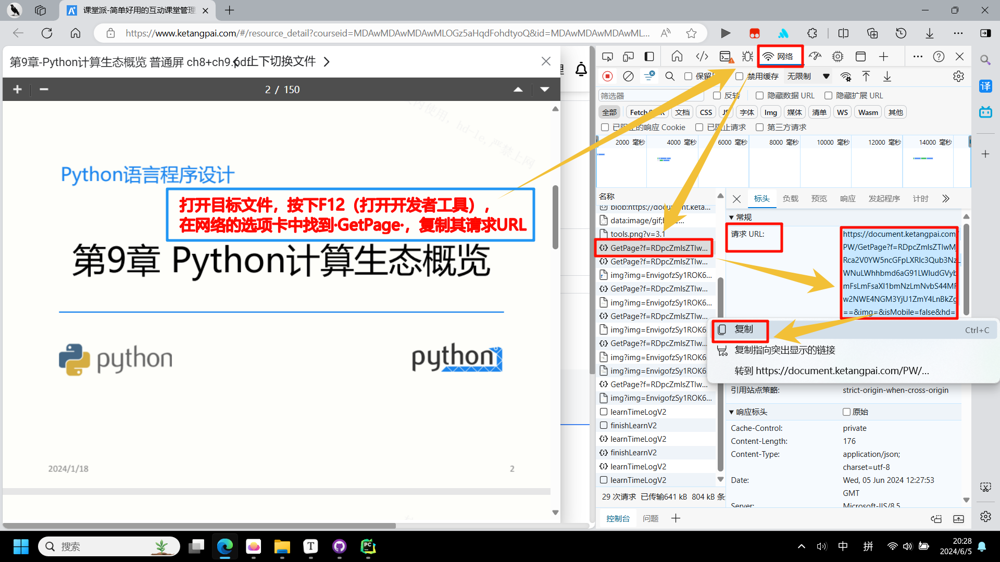
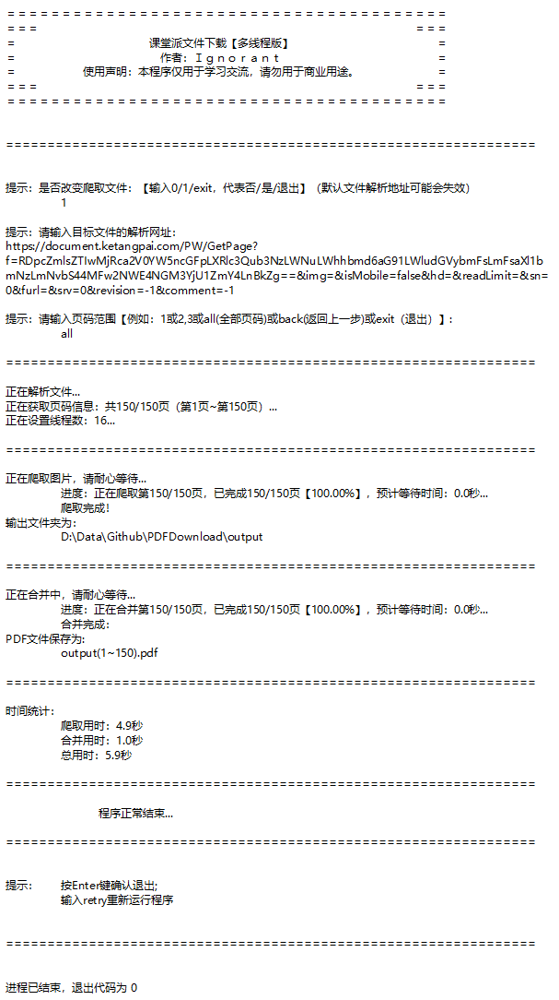

ReadMe

[toc]

# 前言

起因：

- 因版权限制，文件只供查看，禁止下载。

弊端：

- 每次打开都需要网络
- 课堂派的 PDF 查看器使用体验欠佳

思考：

- 利用爬虫下载图片，再合并成完整的 PDF 文档

警告：

- **仅供个人学习使用，严禁用于非法用途**


# 使用说明

## 获取文件的解析地址

1. 打开目标文件
2. 按下F12打开开发者工具
3. 在网络选项卡中找到 `GetPage`的方法名称
4. 复制其请求URL（注意：可以先打开链接再复制链接，因为直接复制可能会包含多余的回车）



## 爬取文件



# 更新日志

```tex
# ###############################################################
# #######
# #                       课堂派文件下载【多线程版】
# #                        作者：Ignorant
# #                 使用声明：本程序仅用于学习交流，请勿用于商业用途。
# #######
# ###############################################################
#                           修订版本
# ###############################################################
#
# 5.4   改进：添加back、retry的指令（利用嵌套函数实现的循环）
#       修复：修复了重复创建output文件夹的bug（该问题会引起360报毒查杀）
#       修复：修复了重复运行重新时未初始化参数导致页码重复的bug
#
# 5.3   改进：提供exit的输入指令，可以退出函数【但是提供back指令以达到返回上一级函数失败了，python没有goto语法】
#       改进：中文对齐函数通过传递多个元组参数，实现一次实现多次居中对齐的功能
#
# 5.2   改进：重命名部分变量和函数的名称，使其更切合其定义；
#       改进：中英文混杂的字符串的居中对齐输出，可实现快速修改分隔符
#       修复：修复打包后程序出现错误自动退出而不提示错误信息的bug,
#       修复：修复打包后，正常退出报错：NameError: name ‘exit‘ is not defined的bug
#
# 5.0   改进：弃用GPT的代码建议，采用CSDN的代码（见参考资料），提高代码的优雅性和效率
#       功能：添加时间统计的功能
#       内测：【同一文件（370页）同一网络（300Mbps）的下载速度对比：单线程版：35+min > 多线程（GPT版）：3+min > 多线程(CSDN版)：2-min】
#
# 4.4   功能：实现程序内输入解析网址【抛弃urllib.parse中的urlencode()函数，自己重写，同时构建其逆函数，避免网址的参数变化后需要重构字典】
#       改进：预计时间采取1位小数
#       内测：【目前可下载pdf、docx文件；pptx文件不行】
#
# 4.2   改进：动态线程分配，根据页码数自动分配线程
#       改进：重新利用pyinstaller打包程序（因为发送给舍友运行不了）【单线程报毒，多线程则正常】
#
# 4.0   功能：实现多线程下载【为防止对目标网站造成过大的压力，最高16线程】
#       分叉：分离单线程版本和多线程版本，单线程版本逐渐废弃
#
# 3.0   重构：代码重新优化
#       修复：修复时间计算的bug、合成pdf页码混乱等bug
#       改进：使用cmd脚本作为启动器【杀毒软件会对pyinstaller打包的程序报毒】
#
# 2.2   功能：增加检查是否存在重复图片的功能
#       修复：修复合并全部图片的bug
#
# 2.0   功能：增加合并图片为PDF的功能
#
# 1.2   功能：增加进度提示的功能，估算剩余时间
#       改进：整理代码结构，拆分代码为多个功能函数（模块化编程）
#
# 1.0   实现最基础的爬取功能，没有花里胡巧的纠错功能
#       历程：定位请求url->模拟请求url->提取json内容，在浏览器打开图片->识别json内容，爬取单张图片->爬取多张图片->保存到指定的文件夹
#
# ###############################################################
```

# 参考资料

- [课堂派资料 PDF 文件下载_课堂派不允许下载的 word 怎么下载-CSDN 博客](https://blog.csdn.net/sucr233/article/details/114501594)
- [Python 异步加载XHR数据抓取——GET与POST请求方式对比](https://blog.csdn.net/qq_17249717/article/details/84326555)
- [python几行代码，把图片转换、合并为PDF文档](https://blog.csdn.net/snrxian/article/details/108916764)
- [Python全局变量和局部变量（超详细，纯干货，保姆级教学）](https://blog.csdn.net/Kristen_jiang/article/details/129780846)
- [Python多线程详解_python 多线程-CSDN博客](https://blog.csdn.net/ifhuke/article/details/128619653)
- 其他：知乎[全角空格输出\u3000]
- GPT：在当前目录下合并图片为PDF
  [因为给出的代码存在PDF页码混乱的bug，所以魔改：利用for循环为合并指定范围内的图片]
- 提供的多线程代码
  [太拉跨了，导致文件下载是一块（多线程数同时）进行的，当线程同时结束才进行下一次[代码臭长，不如CSDN的优雅高效]]

